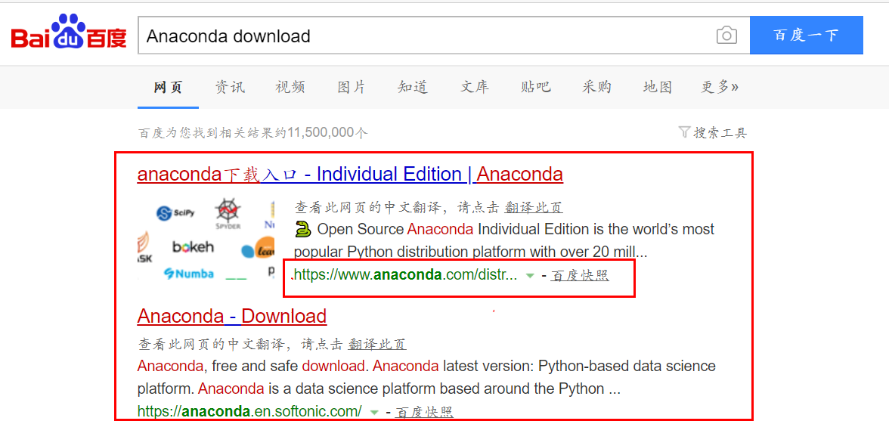
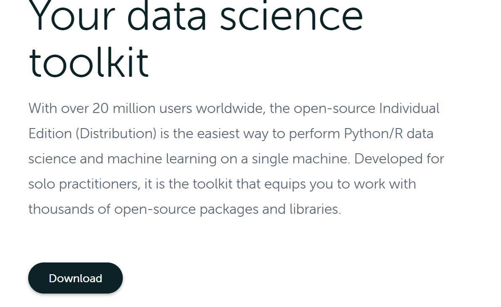
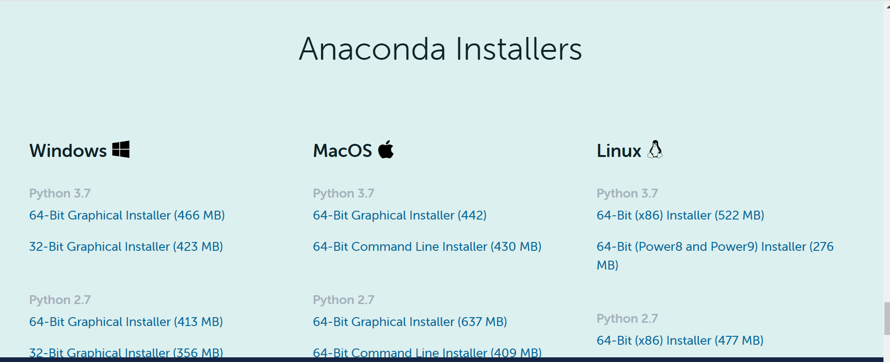
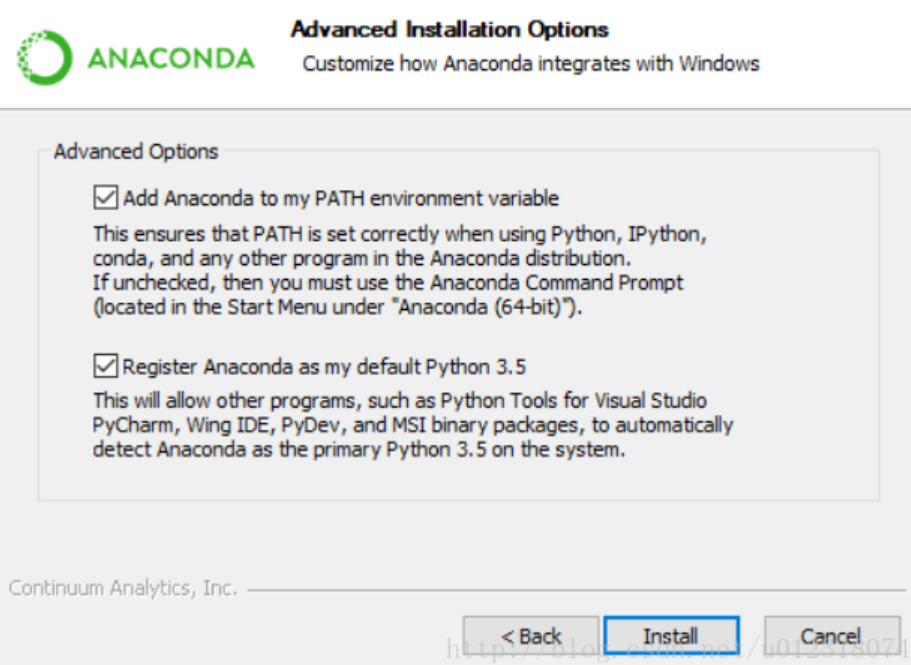
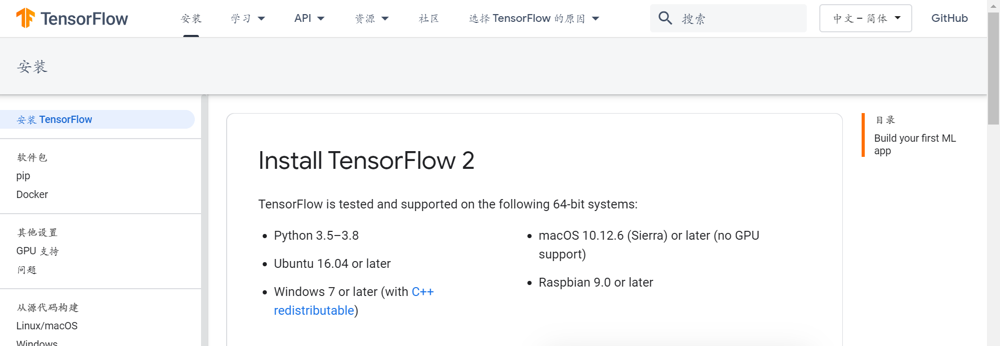
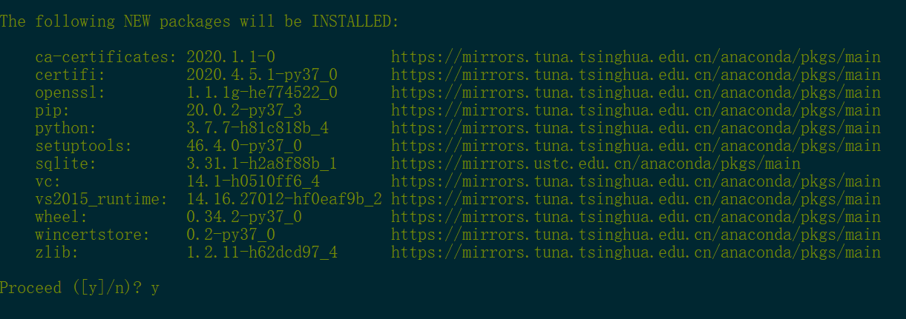
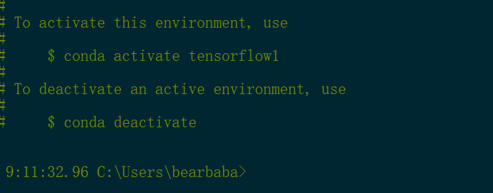
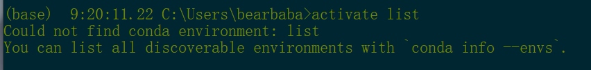
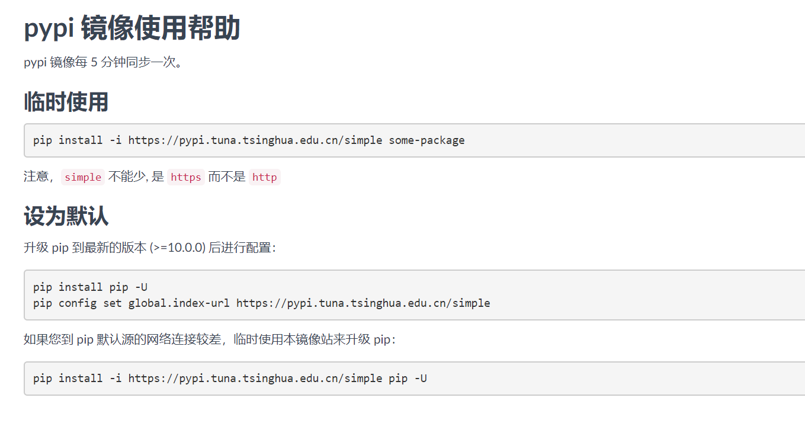

# 安装TensorFlow2.X


`TensorFlow`实际上是一个开源软件库，它可以被Python的包管理工具`pip`安装，通过Python的`import`包导入语句导入使用。

所以我们想要安装`TensorFlow`首先可以选择Python作为系统环境。

## TensorFlow的系统环境


Python拥有不同的发行版本，这里建议使用`Anaconda`这个Python的发行版本。从`anaconda`中文含义巨蟒中可以看出它与我们的Python（大蟒蛇）是存在着天然关系的。

`Anaconda`拥有超过1400个软件包。其中包含`conda`和虚拟环境管理，它们都被包含在`Anaconda Navigator`中，因此用户无需去了解独立安装每个库。用户可以使用已经包含在`Anaconda`中的命令`conda install`或者`pip install`从`Anaconda`仓库中安装开源软件包。`pip`提供了Conda的大部分功能，并且大多数情况下两个可以同时使用。[以上内容是维基百科对`Anaconda`的介绍](https://zh.wikipedia.org/wiki/Anaconda_(Python%E5%8F%91%E8%A1%8C%E7%89%88))

建议使用`Anaconda`的原因在于，它的虚拟环境管理系统允许我们拥有多个Python版本，能够隔离不同项目所需的不同版本的工具包，这意味着我们可以在多个Python版本中安装使用`TensorFlow`，另外一点在于，它会自动为你安装相应的依赖包，而不需要你一个个手动安装。比如，如果我们使用普通版本的Python安装`TensorFlow`时，是需要先安装`numpy`这个依赖包的，而`Anaconda`在安装`TensorFlow`的同时，自动安装好`numpy`。

## Anaconda的下载安装

我们在百度搜索中输入`Anaconda download`，跳转出的搜索结果中的网址如含有`anaconda`表明这正是我们需要的[官网](https://www.anaconda.com/products/individual)提供的下载网址（“官网“二字是超链接）。



打开官网，找到`download`下载按钮，点击下载，页面会跳转到下载区域。



根据自己的系统选择合适的安装包进行下载安装，



笔者这里下载的是64位的Windows版本，Python选择的Python3.7。（~~Python2.7官方已经不维护了~~）

下载好安装包后点击安装即可，对安装位置没什么要求的人可一路Next、I agree，除了需要注意下环境变量设置就没什么需要注意的了。



由于笔者还安装了普通版本的Python3.7，所以此处并没有将`Anaconda`提供的Python作为系统默认使用的版本，可根据实际情况而定。

下载安装完成后，可查看最近添加的软件，其中含有以下磁贴：


`Anaconda Prompt`是`Anaconda`提供给我们的命令行，我们将在这个命令行内创建`tensorflow`的虚拟环境，并安装使用`TensorFlow2.x`。

## 创建TensorFlow2.x虚拟环境

### conda换源

由于`Anaconda`提供的`conda`默认使用的是国外的软件源，下载安装的速度会十分的缓慢，所以在国内我们要将它设置成国内的镜像软件源。

```shell
conda config --add channels https://mirrors.tuna.tsinghua.edu.cn/anaconda/pkgs/free/
conda config --set show_channel_urls yes 
```

也可以使用其他`conda`镜像软件源。例如中科大源：

```shell
conda config --add channels https://mirrors.ustc.edu.cn/anaconda/pkgs/main/
conda config --add channels https://mirrors.ustc.edu.cn/anaconda/pkgs/free/
conda config --add channels https://mirrors.ustc.edu.cn/anaconda/cloud/conda-forge/
conda config --add channels https://mirrors.ustc.edu.cn/anaconda/cloud/msys2/
conda config --add channels https://mirrors.ustc.edu.cn/anaconda/cloud/bioconda/
conda config --add channels https://mirrors.ustc.edu.cn/anaconda/cloud/menpo/
 
conda config --set show_channel_urls yes
```

如果想要删除某个源，可以使用下面的语句：

```shell
conda config --remove channels 'https://mirrors.tuna.tsinghua.edu.cn/anaconda/pkgs/free/' 
```

相应网址改改就能删除其它源。

### 创建虚拟环境

换完`conda`的软件源后，可以使用以下命令创建出一个python版本为3.7的，且名为`tensorflow1`的虚拟环境。

```shell
conda create --name tensorflow1 python=3.7
```

`--name`用来指定虚拟环境的名字，也可以使用其它的名字，而不必使用`tensorflow1`这个名字，`python=3.7`指定这个虚拟环境的Python版本是Python3.7，也可以使用其他Python版本，TensorFlow2.x的官方建议的Python版本在Python3.5~Python3.7都可以。



使用完创建虚拟环境这个命令后敲回车，`conda`会慢慢收集这个虚拟环境所需要的组件，



列举完虚拟环境所需要的组件后，`conda`会询问是否需要安装这些组件，输入y后回车就可以开始安装这些组件。

安装完组件后，`conda`会提示你怎么使用这个虚拟环境，以及怎么退出这个虚拟环境，其中包含`activate`激活虚拟环境命令和`deactivate`退出虚拟环境命令。



在命令行内使用`conda info --envs`命令会列举出所有的虚拟环境，其实在这里如果激活的是一个不存在的虚拟环境，它也会提示你使用列举虚拟环境的命令来列举全部虚拟环境。



## TensorFlow2.x的相关包安装

我们使用`activate tensorflow1`进入到刚刚创建的虚拟环境中。

TensorFlow2.x需要通过`pip`包管理进行下载安装，与`conda`同样，`pip`的默认软件源是在国外，为了提升下载速度，我们需要换到国内的镜像源。

### pip换源

清华镜像源提供了一份`pip`的[使用帮助](https://mirrors.tuna.tsinghua.edu.cn/help/pypi/)



临时使用清华镜像源安装相关包：

```shell
pip install -i https://pypi.tuna.tsinghua.edu.cn/simple some-package
```

将清华镜像源设置成默认（首先需要升级`pip`）：

```shell
pip install pip -U
pip config set global.index-url https://pypi.tuna.tsinghua.edu.cn/simple
```


如果 pip 默认源的网络连接较差，临时使用清华镜像站来升级 pip：

```shell
pip install -i https://pypi.tuna.tsinghua.edu.cn/simple pip -U
```

但是以上方法并不推荐，笔者在将清华镜像源设为默认后，使用`pip`来安装`tensorflow`时，下载一半时就发生了网络错误，无法安装，切换到国内其他高校的镜像源也会发生网络错误。所以，建议使用国内大厂的镜像源，笔者这里切换到了腾讯镜像源，切换与上面一致，只需要将网址改成腾讯源的网址即可，以下提供`pip`源的国内网址。

```txt
腾讯https://mirrors.cloud.tencent.com/pypi/simple
阿里云http://mirrors.aliyun.com/pypi/simple/
中国科技大学https://pypi.mirrors.ustc.edu.cn/simple/
豆瓣(douban)http://pypi.douban.com/simple/
清华大学https://pypi.tuna.tsinghua.edu.cn/simple/
中国科学技术大学http://pypi.mirrors.ustc.edu.cn/simple/
```

### TensorFlow2.x的安装

在切换好`pip`源之后，只需使用以下安装命令就能安装`tensorflow`，

```shell
pip install tensorflow
```

另外再使用以下命令安装`tensorflow`的gpu版本，

```shell
pip install tensorflow-gpu
```

### 测试TensorFlow2.x是否安装

在`anaconda prompt`命令行中，在已进入新创建的有关TensorFlow虚拟环境的情况下，敲入python就能进入python的交互式界面，输入`import tensorflow as tf`导入`tensorflow`包，这一步如果不出现问题，说明`tensorflow`包已正确安装使用。


再输入`print(tf.__version__)`就能输出`tensorflow`的版本，这一步无误说明`tensorflow`已能被使用。

## 虚拟环境的删除

在使用虚拟环境退出命令的前提下，在命令行中敲入以下命令，就能删除名为`tensorflow`的虚拟环境（不要乱用删除命令，这里的`tensorflow`的虚拟环境只是笔者之前创建的，恰好不需要的虚拟环境罢了），

```shell
conda remove -n tensorflow --all
```

## 不使用Anaconda的方案

~~由于`Anaconda`提供的命令行实在太丑了~~，笔者考虑了一下使用普通Python3.7版本的方案，在这种情况下，依然使用`pip`安装`tensorflow`的包可能会需要依赖其它包的安装，那我们可以使用Pycharm这个python的IDE（~~反正不可能光用`Anaconda`的命令行的~~，pycharm代码提示与代码高亮很适合实际项目开发），它会提示包的安装问题，通过它的提示也是可以解决包的依赖问题。Python的`virtualenv`组件也是可以创建虚拟环境的。在不怕折腾的情况下可以使用Python普通版本。