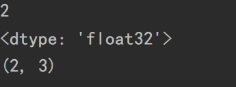

# 张量

`tensorflow`中的基本数据是`tensorflow`，可以看作是多维数组或列表类型。

## 张量的创建


使用`tf.constant()`创建张量，`tf.constant()`的语法格式为：

```python
tf.constant(value,dtype,shape)
```

`value`用来指定数据，`dtype`用来显式地声明数据类型，`shape`用来指定数据的形状，

例如，要生成一个两行三列全为类型`int32`的数字2的张量，可以使用以下代码：

```python
import tensorflow as tf
a = tf.constant(3,dtype=tf.int32,shape=(2,3))
print(a)
```


但是由于`tensor`中的整型数据默认是`tf.int32`的，`dtype`可以不用显式地指定。

`tensorflow`所生成的张量都可以用`numpy`方法转换成对应的数据，例：

```python
import tensorflow as tf
a = tf.constant(3,dtype=tf.int32,shape=(2,3))
print(a)
print(a.numpy())
```


`tensor`的数据类型有：


`constant`函数的`value`参数除了可以是数字外，还可以是`numpy`数组，例：

```python
import numpy as np
b=np.array([1,2,3])
c=tf.constant(b)
print(c)
```


### 全0张量与全1张量的创建

使用`tf.zeros`与`tf.ones`函数进行创建。语法格式：

```python
tf.zeros(shape,dtype = tf.float32)
tf.ones(shape,dtype = tf.float32)
```

例：

```python
b = tf.zeros(2)
c = tf.ones([2, 3])
print("b=", b)
print("c=", c)
```


如果要指定维度大于2的张量，可以将行列数写进数组，如`c = tf.ones([2, 3])`表明创建两行三列的全一张量。

### 创建元素值都相同的张量

`tf.fill()`函数用于创建值都相同的张量，语法格式为：

```python
tf.fill(dims,value)
```

`tf.fill()`函数没有`dtype`参数，它根据传递进的参数自动判断数据类型的。`dims`用于指定形状，例：

```python
d = tf.fill(dims=[2,3],value=9)
print("d=",d)
```


### 创建随机数张量

#### 正态分布

语法格式：

```python
tf.random.normal(shape,mean,stddev,dtype)
```

`mean`意为均值，`stddev`为标准差，

例，创建2X2的正态分布随机数张量：

```python
e = tf.random.normal([2, 2])
print("e=",e)
```


#### 截断正态分布

语法格式：

```python
tf.random.truncated_normal(shape, mean, stddev,)
```

返回值是一个截断的正态分布，截断的标准是2倍的标准差。

#### 创建均匀分布张量

语法格式：

```python
tf.random.uniform(shape, minval, maxval, dtype)
```

`minval`表示最小值，`maxval`表示最大值，前闭后开，不包括最大值。

例：

```python
f = tf.random.uniform(shape=[2, 3], minval=0, maxval=10)
print("f=", f)
```


####  随机打乱

`tf.random.shuffle(x)`函数意为随机打乱张量`x`的第一维，但其实它是可以打乱列表或者数组的，打乱后返回张量类型。

#### 创建序列

`tf.range()`函数可以创建序列，用法与python中的`range`函数类似。语法格式：

```python
tf.range(start, limit, delta=1, dtype)
```

`start`与`limit`分别表示起始数字与结束数字，前闭后开，`delta`表示步长。


### 改变张量数据类型

使用`tf.cast`可以改变张量的数据类型，语法格式为：

```python
tf.cast(x,dtype)
```

例，将`tf.int32`改变成`tf.float32`类型

```python
a = tf.constant(12,dtype=tf.int32,shape=(2,3))
tf.cast(a,dtype=tf.float32)
print(a)
```

`tf.convert_to_tensor`函数能将各种类型的Python对象转换为张量对象。它接受张量对象、数字数组、Python列表和Python标量。

```python
a = [i for i in range(10)]
print("a_type=",type(a))
b = tf.convert_to_tensor(a)
print(b)
```


### tensor对象的属性

可以直接输出张量的`ndim`（维度）、`shape`、`dtype`属性，例：

```python
a = tf.constant(value=2, shape=(2, 3), dtype=tf.float32)
print(a.ndim)
print(a.dtype)
print(a.shape)
```



也可以使用`tensorflow`的`size`、`rank`、`shape`函数来得到张量的长度、维度、形状属性。

```python
print(tf.size(a))
print(tf.shape(a))
print(tf.rank(a))
```

