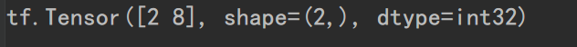

# 张量

`tensorflow`中的基本数据是`tensorflow`，可以看作是多维数组或列表类型。

## 张量的创建


使用`tf.constant()`创建张量，`tf.constant()`的语法格式为：

```python
tf.constant(value,dtype,shape)
```

`value`用来指定数据，`dtype`用来显式地声明数据类型，`shape`用来指定数据的形状，

例如，要生成一个两行三列全为类型`int32`的数字2的张量，可以使用以下代码：

```python
import tensorflow as tf
a = tf.constant(3,dtype=tf.int32,shape=(2,3))
print(a)
```


但是由于`tensor`中的整型数据默认是`tf.int32`的，`dtype`可以不用显式地指定。

`tensorflow`所生成的张量都可以用`numpy`方法转换成对应的数据，例：

```python
import tensorflow as tf
a = tf.constant(3,dtype=tf.int32,shape=(2,3))
print(a)
print(a.numpy())
```


`tensor`的数据类型有：


`constant`函数的`value`参数除了可以是数字外，还可以是`numpy`数组，例：

```python
import numpy as np
b=np.array([1,2,3])
c=tf.constant(b)
print(c)
```


### 全0张量与全1张量的创建

使用`tf.zeros`与`tf.ones`函数进行创建。语法格式：

```python
tf.zeros(shape,dtype = tf.float32)
tf.ones(shape,dtype = tf.float32)
```

例：

```python
b = tf.zeros(2)
c = tf.ones([2, 3])
print("b=", b)
print("c=", c)
```


如果要指定维度大于2的张量，可以将行列数写进数组，如`c = tf.ones([2, 3])`表明创建两行三列的全一张量。

### 创建元素值都相同的张量

`tf.fill()`函数用于创建值都相同的张量，语法格式为：

```python
tf.fill(dims,value)
```

`tf.fill()`函数没有`dtype`参数，它根据传递进的参数自动判断数据类型的。`dims`用于指定形状，例：

```python
d = tf.fill(dims=[2,3],value=9)
print("d=",d)
```


### 创建随机数张量

#### 正态分布

语法格式：

```python
tf.random.normal(shape,mean,stddev,dtype)
```

`mean`意为均值，`stddev`为标准差，

例，创建2X2的正态分布随机数张量：

```python
e = tf.random.normal([2, 2])
print("e=",e)
```


#### 截断正态分布

语法格式：

```python
tf.random.truncated_normal(shape, mean, stddev,)
```

返回值是一个截断的正态分布，截断的标准是2倍的标准差。

#### 创建均匀分布张量

语法格式：

```python
tf.random.uniform(shape, minval, maxval, dtype)
```

`minval`表示最小值，`maxval`表示最大值，前闭后开，不包括最大值。

例：

```python
f = tf.random.uniform(shape=[2, 3], minval=0, maxval=10)
print("f=", f)
```


####  随机打乱

`tf.random.shuffle(x)`函数意为随机打乱张量`x`的第一维，但其实它是可以打乱列表或者数组的，打乱后返回张量类型。

#### 创建序列

`tf.range()`函数可以创建序列，用法与python中的`range`函数类似。语法格式：

```python
tf.range(start, limit, delta=1, dtype)
```

`start`与`limit`分别表示起始数字与结束数字，前闭后开，`delta`表示步长。


### 改变张量数据类型

使用`tf.cast`可以改变张量的数据类型，语法格式为：

```python
tf.cast(x,dtype)
```

例，将`tf.int32`改变成`tf.float32`类型

```python
a = tf.constant(12,dtype=tf.int32,shape=(2,3))
tf.cast(a,dtype=tf.float32)
print(a)
```

`tf.convert_to_tensor`函数能将各种类型的Python对象转换为张量对象。它接受张量对象、数字数组、Python列表和Python标量。

```python
a = [i for i in range(10)]
print("a_type=",type(a))
b = tf.convert_to_tensor(a)
print(b)
```


### tensor对象的属性

可以直接输出张量的`ndim`（维度）、`shape`、`dtype`属性，例：

```python
a = tf.constant(value=2, shape=(2, 3), dtype=tf.float32)
print(a.ndim)
print(a.dtype)
print(a.shape)
```


也可以使用`tensorflow`的`size`、`rank`、`shape`函数来得到张量的长度、维度、形状属性。

```python
print(tf.size(a))
print(tf.shape(a))
print(tf.rank(a))
```


## 张量相关操作

多维张量在物理上以一维的方式连续存储，通过定义维度和形状，在逻辑上把它理解为多维张量。（对于多维数组也同样适用）

### 维度变换

#### 改变张量形状

使用`tf.reshape`改变张量的形状，语法格式：

```python
tf.reshape(tensor,shape)
```

例，将一维张量转换成三维张量：

```python
a = tf.range(24)
print(a)
print(tf.reshape(a, [2, 3, 4]))
```


#### 多维张量的轴

多维张量的维度表示多维张量的轴（`axis`）。


张量的轴带有索引值，从维度最高到最低，使用数字0作为轴索引的开始，（可以理解为张量最外层到最内层的顺序）。也可以使用负数作为倒数的索引，-1表示索引值最大的轴，这一点与Python的列表一致。

#### 增加维度

使用`tf.expand_dims(input, axis)`增加张量维度，语法格式：

```python
tf.expand_dims(input, axis)
```

示例，现有一个`shape`为（2，2）的张量，为它在`axis=0`方向上添加一个维度：

```python
a = tf.constant([[1,2],[3,4]])
print(tf.shape(a))
a = tf.expand_dims(a, axis=0)
print(a)
```


需要注意的是，`tf.expand_dims()`必须要明确指定`axis`的值，指定顶哪个轴就在原张量基础上增加一个指定轴。如果上述代码指定`axis=1`，那么a的`shape`就会是(2, 1, 2)。

#### 删除维度

删除维度用`tf.squeeze()`函数，该函数语法格式：

```python
tf.squeeze(input, axis=None)
```

该函数只能删除长度为1的维度，可以指定`axis`，如果明确不指定`axis`，会删除所有长度为1的维度，可以使用列表来指定多个要删除的维度。

例，原张量`shape`为(1, 2 , 3, 1,  1, 4)，如果分别指定删除全部长度为1的维度和，代码为：

```python
a = tf.constant(1, shape=(1, 2, 3, 1, 1, 4))
print(a.shape)
b = tf.squeeze(a)
c = tf.squeeze(a, [0, 3])
print("b_shape={},c_shape={}".format(b.shape, c.shape))
```


#### 交换维度

交换维度使用`tf.transpose(a, perm)`函数，`perm`指定维度的顺序，例如原本形状为（1，2，3）的张量维度顺序是（0，1，2），现在使用`tf.transpose()`将索引为0的轴和索引为1的轴进行交换：

```python
a = tf.constant(1, shape=(1, 2, 3))
a = tf.transpose(a, perm=[1, 0, 2])
print(a)
```


运行结果显示原先张量`shape`为(1, 2, 3)，现在形状为(2, 1, 3)。

#### 拼接张量

将多个张量在某维度上拼接可以使用`tf.concat(tensors, axis)`函数，`tensors`是包含要被拼接的张量的列表，`axis`指定在哪个轴上进行拼接。

拼接张量是将多个张量在某个维度上进行合并，并不会产生新的维度。

例：

```python
# 指定在0轴上拼接
a = tf.constant(1,shape=(1,2))
b = tf.constant(2,shape=(1,2))
c = tf.concat([a,b],axis=0)
print(c)

# 指定在1轴上拼接
a = tf.constant(1,shape=(1,2))
b = tf.constant(2,shape=(1,2))
c = tf.concat([a,b],axis=1)
print(c)
```


#### 分割张量

分割张量可以用`tf.split(value, num_or_size_splits,axis=0)`函数，`values`是待分割的变量，`num_or_size_splits`是分割方案，分割方案参数可以是一个数值，表示等长分割，数值是分割的份数，也可以是一个列表，表示不等长分割，列表中是切割后每份的长度。例：

```python
a = tf.constant(1, shape=(2, 4))
print("在0轴上分割，每一份是2时：\n", tf.split(a, num_or_size_splits=2, axis=0))
print("在1轴上分割，分割份数之比为1：2：1，", tf.split(a, [1, 2, 1], 1))
```


#### 堆叠张量

堆叠张量使用`tf.stack(values, axis)`函数，`values`是要堆叠的多个张量，`axis`指定插入新维度的位置。

在合并张量时，会创建一个新的维度。例：

```python
a = tf.constant([1, 2, 3])
b = tf.constant([4, 5, 6])

# 在轴为0上进行拼接
print(tf.stack([a, b], axis=0))

# 在轴为1上进行拼接
print(tf.stack([a, b], axis=1))
```


#### 分解张量

分解张量是张量堆叠的逆运算，使用`tf.unstack(values, axis)`函数，

张量会被分解为多个张量，分解后得到的每个张量和原来的张量相比，维度都会少一维。

例：

```python
a = tf.reshape(tf.range(6), shape=(2, 3))
b = tf.unstack(a, axis=0)
print(b)
```


### 部分采样

#### 索引和切片

张量也含有类似于列表的索引的用法，例如，对于一个一维张量提取它的数据就可以用类似`a[0]`来提取，对于二维张量可以通过`a[0, 0]`或者`a[0][0]`来提取第一行第一列的数据。

```python
a = tf.constant([[[1, 2, 3],
          	[4, 5, 6]],
         	[[1, 2, 3],
          	[4, 5, 6]]])
print(a[0, 1, 1])
print(a[0])
```


切片的用法也与列表类似，例：

```python
print(a[0][0][1:])
print(a[0][0:2][0:2])
print(a[0, 0:2, 0:2])
```

注意，`a[0][0:2][0:2]`这种切片方式是错误的，`a[0, 0:2, 0:2]`才能得到我们想要的切片的数据，运行结果如下：


如结果所示，`a[0][0:2][0:2]`只对轴为1的维度进行了切片。

#### 数据提取

`gather(params, indices)`函数可以用一个索引列表，将给定张量中对应索引值的元素提取出来，参数`params`代表输入的张量，`indices`是索引值列表。

例，从一维张量中提取索引分别为0，2，3的元素：

```python
a = tf.range(12, delta=2)
print(tf.gather(a, [0, 2, 3]))
```


`tf.gather()`一次只能对一个维度进行数据提取，可以传入`axis`参数指定要提取哪一维度。

`tf.gather_nd()`函数可以同时对多个维度进行索引，通过指定坐标来采样多个点，

```python
a = tf.range(12, delta=2)
a = tf.reshape(a,(2,3))
print(tf.gather_nd(a, [[0,1],[1,1]]))
```



## 张量运算

 ### 加减乘除四则运算

|算术操作|描述|
|:-:|:-:|
|`tf.add(x,y)`|将x和y逐元素相加|
|`tf.subtract(x,y)`|将x和y逐元素相减|
|`tf.multiply(x,y)`|将x和y逐元素相乘|
|`tf.divide(x,y)`|将x和y逐元素相除|
|`tf.math.mod(x,y)`|将x逐元素求余|

逐元素操作是指把x中的每一个元素与y中的每一个元素逐个地进行运算，但是实际上是可以用数学符号`+-/*%`去代替的。例：

```python
# 逐元素相加
a = tf.constant([1, 2, 3])
b = tf.constant([4, 5, 6])
c = tf.add(a, b)
print(c)

# 逐元素相减
d = tf.subtract(b, a)
print(d)

# 逐元素相乘
e = tf.multiply(a, b)
print(e)

# 逐元素相除
f = tf.divide(a, b)
print(f)

# 逐元素求余
g = tf.math.mod(a, b)
print(g)

print(a - b)
print(a * b)
print(a / b)
print(a + b)
print(a % b)
print(a // b)
```


需要注意的是`/`运算虽然除数与被除数的元素类型都是`int32`的，但是得到的结果却是`float64`，如果想要得到的运算是整除运算可以用`//`来进行整除运算。

### 幂指对数运算

|算术运算|运算描述|
|:-:|:-:|
|`tf.pow(x,y)`|对x求y的幂次方|
|`tf.square(x)`|对x逐个元素求二次方|
|`tf.sqrt(x)`|对x逐元素开平方根|
|`tf.exp(x)`|计算e的x次方|
|`tf.math.log(x)`|计算自然对数，底数为e|

```python
a = tf.reshape(tf.range(6), shape=(2, 3))
print(tf.pow(a, 2))
print(a ** 2)
print(tf.square(a))

print(tf.sqrt(tf.cast(a, dtype=tf.float32)))
print(tf.cast(a, dtype=tf.float32) ** (1 / 2))

print(tf.math.log(tf.cast(a, dtype=tf.float32)))
print(tf.exp(tf.cast(a,dtype=tf.float32)))
```


如上所示，对张量每个元素求平方或平方根也是可以用`**`这种数学符号的，但是需要注意的是在计算自然对数与求平方根时，张量的类型需要是浮点型，使用整型会报错。

由于`TensorFlow`中只有以e为底的自然对数，没有提供其它数值为底的对数运算函数，但是我们可以用数学运算中的换底公式来计算其它底数的对数，$log_a b = \frac{log_c b}{log_c a}$

### 其它运算


### 三角函数与反三角函数运算


### 重载运算符


### 广播机制（broadcaing）

例如，一维张量与二维向量相加时，一维向量中每个元素会与二维向量中最小的那个维度中的每个元素逐个相加。


需要注意的是两个张量最后一个维度的长度必须相等。

```python
a = tf.constant([1, 2, 3])
b = tf.reshape(tf.range(12), shape=(4, 3))
print(a + b)
```


一维张量和三维张量的相加也与一维张量与二维张量相加的情况相同，都是最小维度之间各个元素相加。

数字+N维张量时，这个数字也会与张量的各个元素进行相加。

### 张量乘法

元素乘法：`tf.multiply()`，可以用`*`运算符代替，

向量乘法：`tf.matmul()`，可以用`@`运算符代替。向量乘法采用的乘法是线性代数中的矩阵之间相乘的运算。

```python
a = tf.reshape(tf.range(6), shape=(2,3))
b = tf.reshape(tf.range(6), shape=(3,2))
print(a@b)
```


对于多维张量中的三维张量与三维常量普通乘法之间的运算遵循的原则是最后两位做向量乘法，高维采用广播机制（其实四维也是）。

一图说明：


### 张量数据统计函数

求和函数：`tf.reduce_sum()`，这个函数可以设定`axis`参数，以此来指定对某个维度进行求和，如果不设置，就会默认对所有元素进行求和运算。

与之相似的还有`tf.reduce_mean()`求均值函数，`tf.max()`求最大值函数，`tf.min()`求最小值函数，`tf.argmax()`求最大值索引，`tf.argmin()`求最小值索引。

需要注意的是求均值函数在张量类型为整型时，所得到的均值张量也是整型。

