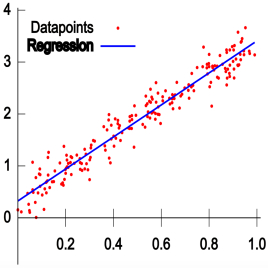
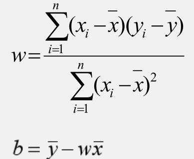
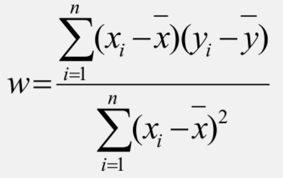

# 机器学习

机器学习算法是指从数据中自动分析获得规律，并利用规律对未知数据进行预测的算法。

举个例子，我们只要知道一个人的出生年份，再结合现在的日期，我们就可以计算出现在这个人的年龄，这样的一个算法符合$y=wx+b$函数，我们可以使用这个已知$w$和$b$参数的函数去计算出任何一个人的年龄，那么机器学习可以看作是如何通过一个算法得到这个$w$和$b$参数的方式，另外需要注意的是我们的数据不可能完全符合$y=wx+b$这样的一元线性回归，也会有$y=w_1x_1+w_2x2+...+w_nx_n+b$这样的多元线性回归，甚至存在离散类的数据（即数据不是连续性的）。

在哲学概念中有个普遍联系的概念，通常是指事物或现象之间以及事物内部要素之间相互连结、相互依赖、相互影响、相互作用、相互转化等相互关系。既然存在联系，那么就可以通过数据来稍稍预测一下结果，对于可以看作一元线性回归的问题，那我们是更希望模型能更加精准，精准的程度一部分原因取决于如何计算出$w$与$b$的算法。这样其实就可推导出，机器学习一部分目的是要求解出数据之间存在联系的那个参数值的大小。

## 模型

机器学习主要就是为了创建一个合适的模型，使模型能通过现有的数据得到一个合适的预测值，$y=wx+b$就是一个典型的一元线性回归模型。下述这张图符合一元线性回归模型：



中间那条从红点穿插而过的线就是一元线性回归模型所表示的函数。

## 监督学习与无监督学习

### 监督学习

监督学习可以分为回归问题分类问题，

回归问题是预测连续值，而分类问题则是预测离散值。

数据可能有明确的数值，也有可能存在不明确数值的数据，像通过温度、湿度等数据来推测天气情况可以看作是监督学习，这些数据是经过测量的，它们被人为标记过了，所以可以简单来说，通过被标记过的数据寻找数据之间的联系的是监督学习。

### 无监督学习

总有些数据是没有被标记过的，但是它们之间存在联系。举个例子，我们把全世界的同龄的人聚集在一起，不通过测量身高来判定他们的高矮程度，只需要一一比对后，得到最矮的那个人和最高的那个人，那么显然身高接近最高的人的身高可以大致被判定为高，同样的，身高接近最矮的那个人的身高可以被判定为矮，像这样不通过明确数值，而是通过数据之间的差值的判定高矮程度可以看作是无监督学习。

我这里比对的人群是同龄人群，因为拿9岁孩子的身高和20岁成年人的身高是不太合理的，像这样通过年龄划分人群的方式可以看作是聚类，聚类的含义是将相似度高的样本聚合在一起。


## 一元线性回归

现在我们将通过简单的一元线性回归问题来更加了解下机器学习。

一元线性回归的模型使用$y=wx+b$来表示，这里的$x$称为模型变量，$w$与$b$是模型参数，$w$被称为权重，$b$被称为偏置值。

对于下面的$x$、$y$轴来说，上面的数据实际上数据之间画上无数条表示预测模型的直线的，但是我们想要得到的是一条尽可能让数据符合模型的直线，我们依赖于数学通过计算得到每条线上的预测值与真实值之间的误差去判断出哪条直线更为合适，那条最合适的直线被称为最佳拟合直线。

现在我们的估计值用$\hat{y_i}$去表示，那么预测模型改为$\hat{y_i}=wx_i+f$，真实值用$y_i$表示，估计值与真实值之间的误差就是$y_i-\hat{y_i}=y_i-(wx_i+b)$，这个误差可以称为拟合误差或者残差。

显然现在我们需要一个函数能够计算出残差之和大小，这个函数就是损失函数$Loss$，$Loss=\sum_{i=1}^n(y_i-\hat{y_i})=\sum_{i=1}^n(y_i-(wx_i+b))$，我们最终希望这个损失函数得到的值能越小越好，但是由于涉及到求和运算，负值会与正值相互抵消，所以这里不能简单使用求和运算。那么考虑对每个残差的绝对值进行相加，但是求残差值最小实际上是在求最值，最终是要涉及到求导运算的，然而绝对值并不方便求导运算，所以这里考虑使用残差平方之和，再添加个$\frac{1}{2}$以方便求导运算，那么$Loss=\frac{1}{2}\sum_{i=1}^n(y_i-\hat{y_i})^2=\frac{1}{2}\sum_{i=1}^n(y_i-(wx_i+b))^2$，这个函数称为平方损失函数。

现在我们明白了损失函数的概念，它具有以下两个特性：

1. 非负性：保证样本误差不会相互抵消，
2. 一致性：损失函数的值和误差变化一致。

现在我们的问题就变成了$w$、$b$取何值时，$Loss$取值最小，的求极值问题，根据极值点的偏导数为零这个结论，我们可以得到$\frac{\partial{Loss}}{\partial{w}}=0$和$\frac{\partial{Loss}}{\partial{b}}=0$，只要能够求解这两个函数组成的方程组就能得到$w$、$b$参数表示方式，现给出$w$与$b$的数学表示方式之一：



我们在知道参数的数学表达式之后，实际上不借助`tensorflow`也是可以根据表达式写出我们需要的程序的，但是为了体现`tensorflow`的优越性，我们依然选用`tensorflow`来解决一元线性回归问题。

### 案例

我们用过往面积与房价之间的关系来估计下未来的房价，显然这里的过往面积将成为参数$x_i$，过往房价则是$\hat{y_i}$。我们根据上述已给出的$w$和$b$的数学表达式，通过$x_i$与$\hat{y_i}$就能计算出$w$和$b$，

```python
import tensorflow as tf
import matplotlib.pyplot as plt


class ForecastModule:
    def __init__(self, x_array, y_array):
        self.x_array = x_array
        self.y_array = y_array
        self.w = 0
        self.b = 0
        self.x_text = None
        self.y_text = None

    def get_parameter(self):
        x_mean = tf.reduce_mean(self.x_array)
        y_mean = tf.reduce_mean(self.y_array)
        self.w = tf.reduce_sum((self.x_array - x_mean) * (self.y_array - y_mean)) / tf.reduce_sum(
            tf.square((self.x_array - x_mean)))
        self.b = y_mean - self.w * x_mean
        

if __name__ == '__main__':
    x = tf.constant(
        [137.97, 104.50, 100.00, 124.32, 79.20, 99.00, 124.00, 114.00, 106.69, 138.05, 53.75, 46.91, 68.00, 63.02,
         81.26, 86.21])
    y = tf.constant(
        [145.00, 110.00, 93.00, 116.00, 65.32, 104.00, 118.00, 91.00, 62.00, 133.00, 51.00, 45.00, 78.50, 69.65, 75.69,
         95.30])
    forecast_module = ForecastModule(x, y)
    forecast_module.get_parameter()
```

上述代码将获取$w$和$b$的方法进行了封装，在`main`函数中将过往面积与房价的列表通过`tf.constant()`函数转换成了张量，并将这两个张量传递给了对象`forecast_module`。在`ForecastModule`类中`get_parameter(self)`函数就是用来获取$w$和$b$参数的函数，它所进行的运算实际上并不复杂。

在`get_parameter(self)`函数中，`tf.reduce_mean()`函数用来计算出列表张量的平均数，其实就是用来获取$x_i$与$y_i$的。

```python
self.w = tf.reduce_sum((self.x_array - x_mean) * (self.y_array - y_mean)) / tf.reduce_sum(tf.square((self.x_array - x_mean)))
```

上述代码是`get_parameter(self)`函数中用来求取$w$参数的，它是参照下述的公式得到的。



`self.x_array-x_mean`实际是将张量`x_array`的每个值都分别去减`x_mean`，这是张量运算的广播机制，在之前的`tensorflow运算`中曾经介绍过。同样的，`(self.x_array - x_mean) * (self.y_array - y_mean)`也是基于张量的运算机制。`tf.reduce_sum`是张量的求和函数，`tf.square()`是求取张量每个值的平方值，此处不再赘述。

在得到$w$的值后，$b$的值根据`self.b = y_mean - self.w * x_mean`就可轻松求解。

在拥有$w$与$b$的值之后，就可根据$y=wx+b$通过输入的`x`得到预测的`y`了。

## 多元线性回归

在一个回归分析中包含两个或两个以上的自变量称为多元回归，对于因变量和自变量之间是线性关系的多元回归称为多元线性回归，它的模型与一元线性回归相似，为$y=w_ix_i+w_2x_2+...+w_mx_m+b$，其中参数$b$可以表示为$w_0x_0$，取$x_0=1$，用向量形式表示就是：$\hat{y}=w_0x^0+w_1x^1+...+w_mx^m=W^TX$，其中$W$是所有$w$参数组成的行向量，而$X$则是所有$x$参数组成的行向量，把行向量$W$变成列向量就是矩阵的转置，加上标$T$表示转置。

那么平方和损失函数$Loss=\sum_{i=1}^n(y_i-\hat{y_i})^2$可以表示为$\sum_{i=1}^n(y_i-W^TX_i)^2$，为方便计算，最终的表达式为：$Loss=(Y-XW)^T(Y-XW)$，$Y$就是所有的$y_i$组成的向量。

那么这一问题也就成为了求极值问题：参数向量$W$取何值时，$Loss$函数达到最小。

这里依然使用偏导数求解，即求$\frac{\partial{Loss}}{\partial{W}}=0$时的解，进一步推导出$W=(X^TX)^{-1}X^TY$。

```python
class ForecastModule:
    def __init__(self, x1, x2, y):
        self.x1 = x1
        self.x2 = x2
        self.y = y
        self.w = None

    def get_parameter_w(self):
        x0 = tf.ones(len(self.x1))
        x = tf.stack((x0, self.x1, self.x2), axis=1)
        y = tf.reshape(self.y, shape=(-1, 1))
        xt = tf.transpose(x)
        xtx_1 = tf.linalg.inv(tf.matmul(xt, x))
        xtx_1xt = tf.matmul(xtx_1, xt)
        w = tf.matmul(xtx_1xt, y)
        w = tf.reshape(w, shape=(3,))
        self.w = w

    def get_pred_y(self, x1, x2):
        y_pred = self.w[1] * x1 + self.w[2] * x2 + self.w[0]
        return y_pred


if __name__ == '__main__':

    x1 = tf.constant(
        [137.97, 104.50, 100.00, 124.32, 79.20, 99.00, 124.00, 114.00, 106.69, 138.05, 53.75, 46.91, 68.00, 63.02,
         81.26, 86.21])
    x2 = tf.constant([3, 2, 2, 3, 1, 2, 3, 2, 2, 3, 1, 1, 1, 1, 2, 2], dtype=tf.float32)
    y = tf.constant(
        [145.00, 110.00, 93.00, 116.00, 65.32, 104.00, 118.00, 91.00, 62.00, 133.00, 51.00, 45.00, 78.50, 69.65, 75.69,
         95.30])
    forecast_module = ForecastModule(x1, x2, y)
    forecast_module.get_parameter_w()
    y_pred = forecast_module.get_pred_y(x1, x2)
```

在上述`ForecastModule`类中`get_parameter_w(self)`的作用是在依据上述公式的基础上获取$W$的值。`xt = tf.transpose(x)`对应的是$W^T$，`tf.transpose(x)`的作用就是在进行转置操作。` xtx_1 = tf.linalg.inv(tf.matmul(xt, x))`这一步操作对应公式内的$(XX^T)^{-1}$，因为最终需要的`W`的列向量，那么就需要进行一个转置操作`w = tf.reshape(w, shape=(3,))`。

有了列向量$W$的值，就可以通过公式获取预测的`y`值，这就对应着上述代码的`get_pred_y(self)`的操作。