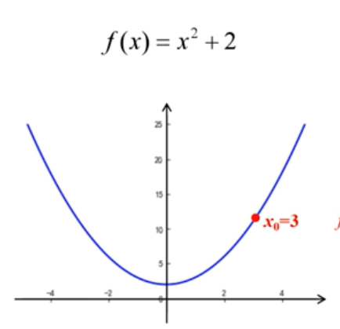

# 机器学习极简入门

## 梯度下降法

之前我们在多元线性回归以及一元线性回归中，我们对机器学习问题的解决方案，是通过先求解它们的参数$w_i$与$b$，然后再依据公式计算得到预测模型完成的，像这样严格依据公式求解出的精确答案称为“解析解”，但是对于多个数据点（n>>2)的情况，可能存在无解析解的情况，因而我们只能借助数值方法去优化出一个近似的“数值解”，梯度下降法是神经网络训练中最常用的优化方法。

如果要求解一个函数的极大、极小值，可以简单地令导数函数为0，求出对应的自变量点（称为驻点），再检验驻点类型即可。

如下是$f(x)=x^2+2$一元凸函数的函数图像，

现在我们在这个函数图像上选取一点作为起始点，它可以以一定的步长向上移动或者向下移动，然后每次选取其中的$y$值较小的一点，只需要移动一定的次数它是可以接近于极小值点的。

当然，也有可能因为选取的步长太大，导致不断地跳过极值点发生震荡现象。震荡现象分为两种，一种不断震荡，但是最终会收敛于极值点，另一种则始终不能收敛于极值点。

现在我们可以发现步长一旦设置太小会增加迭代次数，收敛速度慢；步长设置太长，可能导致无法收敛。为了解决这一问题，我们观察发现，越靠近极值点的点的斜率越小，越远离极值点的点的斜率越大，那么只需要让步长与斜率保持正比例关系即可实现自动调节步长，以数学公式来表示就是：$\eta\frac{df(x)}{dx}$，其中$\eta$表示学习率。那么下一次点出现的位置由上一次迭代的点的位置来表示就是：$x^{k+1}=x^k-\eta\frac{df(x)}{dx}$

那么对于二元凸函数求极值$z=f(x,y)$来说，

> $x^{(k+1)}=x^{k}-\eta\frac{\partial{f(x,y)}}{\partial{x}}$
> $y^{(k+1)}=y^{k}-\eta\frac{\partial{f(x,y)}}{\partial{y}}$

$\frac{\partial{f(x,y)}}{\partial{x}}$和$\frac{\partial{f(x,y)}}{\partial{y}}$组成的向量是这个二元凸函数的梯度。

在这个二元凸函数上的某一点的导数就是这个一点的变化率。

而偏导数$\frac{\partial{f(x,y)}}{\partial{x}}$是函数在$x$方向的变化率，偏导数$\frac{\partial{f(x,y)}}{\partial{y}}$是函数在$y$方向上的变化率。

方向导数是函数沿着某一个方向的变化率。

梯度可以表示为：$\vec{grad}f(x,y)=\frac{\partial{f}}{\partial{x}}\vec{i}+\frac{\partial{f}}{\partial{y}}\vec{j}$，也可以表示成：

$$
\bigtriangledown=\left[
\begin{matrix}
\frac{\partial{f(x,y)}}{\partial{x}}\\
\frac{\partial{f(x,y)}}{\partial{y}}
\end{matrix}
\right] 
$$
梯度的模为方向导数最大值，方向是取得最大方向导数的方向。

只要能够把损失函数描述成凸函数，就能采用梯度下降法以最快的速度更新权值向量$w$，找到使损失函数达到最小值点的位置。

