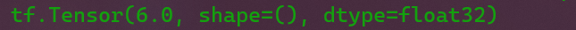
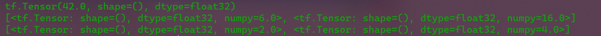

# 机器学习极简入门

## 梯度下降法

之前我们在多元线性回归以及一元线性回归中，我们对机器学习问题的解决方案，是通过先求解它们的参数$w_i$与$b$，然后再依据公式计算得到预测模型完成的，像这样严格依据公式求解出的精确答案称为“解析解”，但是对于多个数据点（n>>2)的情况，可能存在无解析解的情况，因而我们只能借助数值方法去优化出一个近似的“数值解”，梯度下降法是神经网络训练中最常用的优化方法。

如果要求解一个函数的极大、极小值，可以简单地令导数函数为0，求出对应的自变量点（称为驻点），再检验驻点类型即可。

如下是$f(x)=x^2+2$一元凸函数的函数图像，


现在我们在这个函数图像上选取一点作为起始点，它可以以一定的步长向上移动或者向下移动，然后每次选取其中的$y$值较小的一点，只需要移动一定的次数它是可以接近于极小值点的。


当然，也有可能因为选取的步长太大，导致不断地跳过极值点发生震荡现象。震荡现象分为两种，一种不断震荡，但是最终会收敛于极值点，另一种则始终不能收敛于极值点。


现在我们可以发现步长一旦设置太小会增加迭代次数，收敛速度慢；步长设置太长，可能导致无法收敛。为了解决这一问题，我们观察发现，越靠近极值点的点的斜率越小，越远离极值点的点的斜率越大，那么只需要让步长与斜率保持正比例关系即可实现自动调节步长，以数学公式来表示就是：$\eta\frac{df(x)}{dx}$，其中$\eta$表示学习率。那么下一次点出现的位置由上一次迭代的点的位置来表示就是：$x^{k+1}=x^k-\eta\frac{df(x)}{dx}$

那么对于二元凸函数求极值$z=f(x,y)$来说，

> $x^{(k+1)}=x^{k}-\eta\frac{\partial{f(x,y)}}{\partial{x}}$
> $y^{(k+1)}=y^{k}-\eta\frac{\partial{f(x,y)}}{\partial{y}}$

$\frac{\partial{f(x,y)}}{\partial{x}}$和$\frac{\partial{f(x,y)}}{\partial{y}}$组成的向量是这个二元凸函数的梯度。

在这个二元凸函数上的某一点的导数就是这个一点的变化率。

而偏导数$\frac{\partial{f(x,y)}}{\partial{x}}$是函数在$x$方向的变化率，偏导数$\frac{\partial{f(x,y)}}{\partial{y}}$是函数在$y$方向上的变化率。

方向导数是函数沿着某一个方向的变化率。

梯度可以表示为：$\vec{grad}f(x,y)=\frac{\partial{f}}{\partial{x}}\vec{i}+\frac{\partial{f}}{\partial{y}}\vec{j}$，也可以表示成：

$$
\bigtriangledown=\left[
\begin{matrix}
\frac{\partial{f(x,y)}}{\partial{x}}\\
\frac{\partial{f(x,y)}}{\partial{y}}
\end{matrix}
\right] 
$$
梯度的模为方向导数最大值，方向是取得最大方向导数的方向。

只要能够把损失函数描述成凸函数，就能采用梯度下降法以最快的速度更新权值向量$w$，找到使损失函数达到最小值点的位置。

### 梯度下降法在线性回归中的应用

在一元线性回归中我们已经给出过它的平方损失函数$Loss=\frac{1}{2}\sum_{i=1}^n(y_i-\hat{y_i})^2=\frac{1}{2}\sum_{i=1}^n(y_i-(wx_i+b))^2$，对它再进行展开后的结果为：$\sum_{i=1}^{n}(x_i^2w^2+b^2+2x_iwb-2y_ib-2x_iy_iw+y_i^2)$，它可以看成$Aw^2+Bb^2+Cwb+Dw+Eb+F$这样一个二元二次方程，在三维中，它的函数图像是一个凸函数，那么可以用梯度下降法求解它的极值，因此可以得到如下模型更新算法的方程组：

$$
w^{(k+1)}=w^{(k)}-\eta\frac{\partial{Loss(w,b)}}{\partial{w}}\\
b^{(k+1)}=b^{(k)}-\eta\frac{\partial{Loss(w,b)}}{\partial{b}}
$$

将损失函数分别对$w$与$b$的偏导数代入公式得到最终的迭代公式为：

$$
w^{(k+1)}=w^{(k)}-\eta\sum_{i=1}^{n}x_i(wx_i+b-y_i) \\
b^{(k+1)}=b^{(k)}-\eta\sum_{i=1}^{n}(wx_i+b-y_i)
$$

### 均方差损失函数

除了平方损失函数比较常用外，均方差损失函数也比较常用：

$$
Loss=\frac{1}{2n}\sum_{i=1}^n(y_i-(wx_i+b)^2)
$$

它的模型更新算法为：

$$
w^{(k+1)}=w^{(k)}-\frac{\eta}{n}\sum_{i=1}^{n}x_i(wx_i+b-y_i) \\
b^{(k+1)}=b^{(k)}-\frac{\eta}{n}\sum_{i=1}^{n}(wx_i+b-y_i)
$$

### 梯度下降法在多元线性回归中的应用

多元线性回归的数学公式可以用$\hat{Y}=XW$表示，那么它的损失函数可以表示为$Loss=\frac{1}{2}(Y-\hat{Y})^2=\frac{1}{2}(Y-XW)^2$，那么它的权值更新算法就能表示为：$W^{(k+1)}=W^{(k)}-\eta\frac{\partial{Loss(W)}}{\partial{W}}$，而$\frac{\partial{Loss}}{\partial{W}}=X^T(XW-Y)$。

### 超参数

我们在上述得到的模型更新算法中都不可避免地用到了学习率$\eta$，它的数值需要我们手动设置。对于凸函数而言，只要学习率设置的足够小，就可以保证一定收敛

像学习率这样的，需要我们手动设置的参数，而不是通过训练得到的，被称之为超参数。

## 可训练变量

### Variable对象

TensorFlow有着强大的自动求导机制。TensorFlow提供`Variable`对象，它是对`Tensor`对象的进一步封装，能够在模型训练过程中自动记录梯度信息，然后由算法自动优化。

```python
tf.Variable(initial_value, dtype)
```

通过上述代码，`initial_value`参数就会被转换成相应的`dtype`的`Variable`对象，`initial_value`参数可以是数字、Python列表、张量对象。

```python
import tensorflow as tf
a=tf.constant(3)
b=tf.Variable(a)
print(b)
print(tf.Variable(3.))
```


可以通过`assign()`方法将修改`Variable()`对象的值，例：

```python
import tensorflow as tf
a=tf.Variable(3)
b=a.assign(4)
print(b)
```


可以看到`Variable`对象`a`的值已经被修改成“4”了。

除此之外，还有`assign_add()`方法可以在；原有变量基础上增加相应值，`assign_sub()`方法在原有变量基础上减去相应值。

### 自动求导——GradientTape

我们可以用以下语法格式来进行求导：

```python
with GradientTape() as tape:
	函数表达式
grad=tape.gradient(函数， 自变量)
```

例如我们要求$y=x^2$在$x=3$处的导数就可以用：

```python
import tensorflow as tf
x=tf.Variable(3.)#自变量要转成Variable变量
with tf.GradientTape() as tape:
    y=tf.square(x)#函数表达式
dy_dx=tape.gradient(y,x)#y是函数，x是自变量
print(dy_dx)
```



它的计算结果与正确答案一致。

`tf.GradientTape(persistent, watch_accessed_variables)`中的`persistent`参数值是一个布尔值，默认为`False`，这意味着求导只有一次，求完导后就会被销毁；为`True`时，可以多次求导。
`watch_accessed_variables`参数也是一个布尔值，为`False`时，不能够监视自变量，这也意味着求不出导数，当它为`False`时，可以通过手动设置`tape.watch([自变量])`来监视自变量进行求导。

`tape.gradient(函数, 自变量)`中的自变量可以是多个自变量，只需要多个自变量放入一个列表中即可。

#### 求二阶偏导数的例子

现在我们对函数$f(x,y)=x^2+2y^2+1$分别求它对$x=3$与$y=4$的二阶偏导。

```python
import tensorflow as tf
x = tf.Variable(3.)
y = tf.Variable(4.)

with tf.GradientTape(persistent=True) as tape2:
    with tf.GradientTape(persistent=True) as tape1:
        f = tf.square(x)+2*tf.square(y)+1

    first_grads = tape1.gradient(f,[x,y])
second_grads = tape2.gradient(first_grads, [x,y])

print(f)
print(first_grads)
print(second_grads)
```



上述代码分别求出了函数$f(x,y)$在$x=3$和$y=4$时的$f(x, y)$的值，与$f(x, y)$对$x$、$y$的一阶偏导与二阶偏导，关键在于`with tf.GradientTape as tape`的连续使用。

### 模型评估

以上我们可以通过`tensorflow`的自动求导机制来帮助我们求取`Loss`损失函数，但是通过损失函数得到的模型需要区分好坏以应用到实际使用中。这里有几个需要注意的概念：

> 误差：学习器的预测输出和样本真实标记之间的差异。
> 训练误差： 训练集上的误差。
> 泛化误差：在新样本上的误差。
> 过拟合：学习过度，在训练集上表现很好，在新样本上泛化误差很大。
> 欠拟合：学习不足，没有学习到样本上的通用特征。

机器学习的目标在于使泛化误差小，训练集用来训练模型，测试集用来测试学习器在新样本上的预测或判断能力。

### Variable在一元线性回归中的应用

