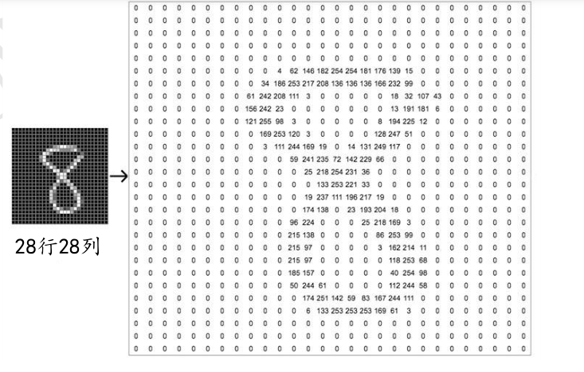

# 分类问题

## 手写数字集

分类问题中比较广泛用于入门的案例是0~9手写数字集的识别。

我们首先需要收集大量真人手写的数字图片，为了方便识别，需要将这些图片的大小固定为某一大小，比如244像素的行乘244像素的列的大小，或者96像素乘96像素大小。这些照片将作为输入变量x，我们需要为这些图片标注一个标签，作为真实值的输出y，这个标签表明图片的数字。一般标签使用从0开始编号的数字，这种方式叫做数字编码。

如果希望模型能够在新样本上能具有良好的表现，即模型泛化能力较好，那我们需要增加数据集的规模和多样性，是我们用于学习的训练数据集能与真实的手写图片分布尽可能地逼近，以方便去识别模型从未识别过的图片。

在tensorflow中已经预置了手写数字图片数据集，被命名为`MINST`，它包含0~9十种数字的图片，每种数字图片7000张，总共70000张。其中60000张图片作为训练集用来训练模型，剩下10000张图片作为测试集。

```python
import tensorflow as tf
from tensorflow.keras import datasets

(x, y), (x_val, y_val) = datasets.mnist.load_data()
```

以上我们通过两个元组分别加载训练集和测试集（由于加载时需要将数据集下载至本地，可能会因为网络问题无法加载，可以下载保存好的数据集，再使用numpy进行导入）。

对于图片来说，一张图片包含h行，w列，每个位置保存了像素（pixel）值，像素值一般使用0~255的整形数值来表达颜色强度信息，如果是彩色图片，则每个像素又包含R、G、B三个通道的强度信息，分别表示红色通道、绿色通道、蓝色通道的颜色强度，它的每个像素点使用一个1维、长度为3的向量（Vector）来表示像素点上的RGB信息。对于手写数字图片来说只需要使用一个形状为[h, w]的二维矩阵来表示图片信息（也可以保存为[h, w, 1]形状的张量）。

下图是数字8的矩阵内容，图片中的像素信息使用灰度信息0~255表示，越大的像素点，对应矩阵位置中数值也越大。



## 模型构建

对于一个多输入、多输出的神经元模型可以用数学表示为$y=Wx+b$，如果是多输出节点、批量训练的方式，它的模型可以写成为批量形式：

$$
Y=X@W+b
$$

@表示矩阵相乘

我们用$d_in$表示输入节点数，用$d_out$表示输出节点数，$X$形状为$[b, d_in]$，表示b个样本的输入数据，每个样本的特征长度为$d_in$；$W$的形状为$[d_in, d_out]$；偏置向量$b$形状为$d_out$，每个输出节点上均需要加一个偏置量。

由于$X@W$的运算结果是形状为$[b, d_out]$的矩阵，与向量b并不能直接相加，因此向量b需要扩展为形状为$[b, d_out]$的矩阵。

考虑两个样本，输入特征长度为$d_in=3$，输出特征长度$d_out=2$的模型，那么可以表示为：


一张灰度图片使用矩阵存储，它的形状为[h, w]，b张图片使用形状为[b, h, w]的张量存储，我们的模型只接受向量形式的输入特征向量，需要将[h, w]表示成[h·w]的向量进行存储，那么输入特征长度$d_in = h·w$

## 独热编码

对于输出标签y，我们介绍了数字编码来表示它的编码信息，但是数字之间存在着天然的大小关系，而这些数字并不需要去体现它的大小关系，因而采用数字编码会迫使模型去学习这种不必要的约束。

那么我们采用独热编码（one-hot）的方式来为图片编码，例如对数字编码0来说，它的独热编码可以为[1,0,0,0]；对于数字1来说，独热编码可以是[0, 1, 0, 0]，即把索引为i的位置设置为1，其它位置设置为0。在`tensorflow`中，独热编码被封装成了一个方法，可以使用`tf.one_hot(x, depth)`通过指定`depth`编码数量为变量`x`进行编码。例：

```python
import tensorflow as tf

y = tf.constant([0, 1, 2, 3])
y = tf.one_hot(y, depth=4)
print(y)
```


